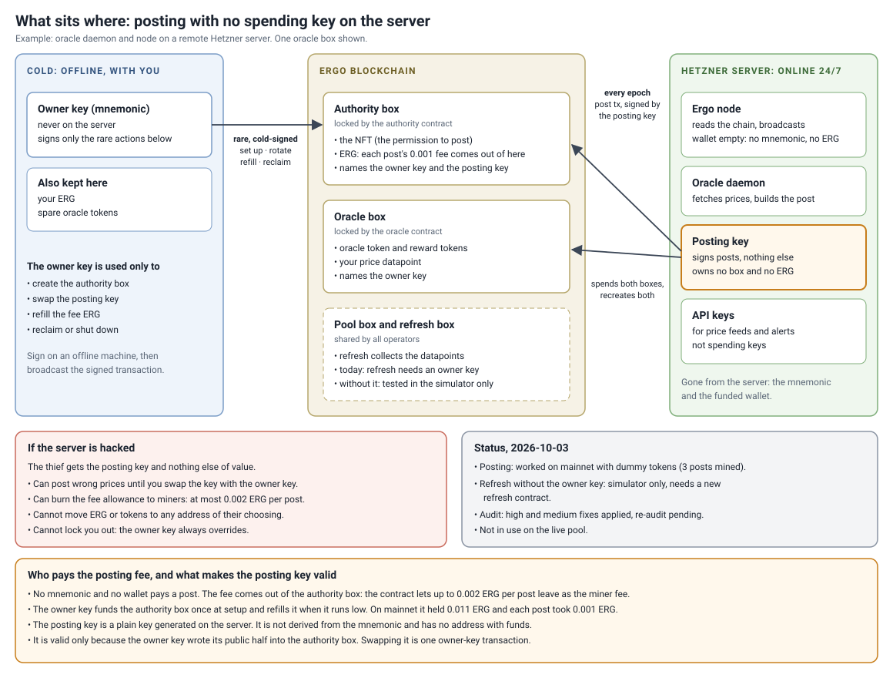
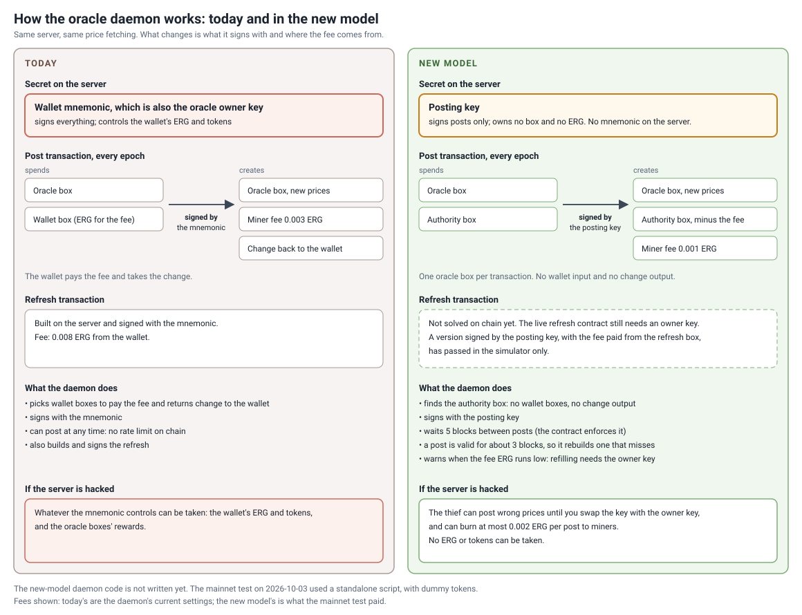

# Companion Authority Box: oracle posting with a no-spend key on the operator's server

> **Status: proof of concept, for review. Not in use on any live pool.**
> Posting worked on mainnet with dummy tokens on 2026-10-03. Refresh is not covered yet (see [The goal](#the-goal-a-remote-box-with-limited-authority)).

## The goal: a remote box with limited authority

An oracle operator runs an always-online, internet-connected machine (the "operator's server"): a rented server, a box at home, or a machine at work. Today oracle-core signs datapoints and refreshes with the operator's wallet mnemonic, so the operator's server holds it.

For a pool that secures a stablecoin of real value, that is too much risk to place on every operator getting the security of their server and network right. Few operators are security or network engineers. Setup mistakes, a missed security update, an exposed port, a compromised dependency, a leaked SSH key, or third-party access (a hosting provider, a workplace network, anyone else on the same network) are all realistic.

The goal is to cut what the operator's server can do down to the job it performs, and nothing more:

1. **The operator's server may hold a key, but that key must have no spending power.** It cannot move ERG or tokens to any address, and it owns no funded address. A smaller funded wallet on the operator's server does not meet this goal; it is the same risk at a lower amount.
2. **Everything of value is controlled by an owner key that never touches the operator's server.** That covers ERG, the oracle token, rewards, and the right to rotate or revoke the key on the operator's server.
3. **A fully compromised operator's server costs a bounded, known amount.** That means wrong datapoints until the owner rotates the key, plus at most a contract-capped fee per post burned to miners.
4. **The operator's routine setup should be safe by default**, without depending on the operator hardening their server correctly.

This repo meets rules 1 to 3 for **posting**. The operator's server keeps one **posting key**, which can update the operator's own oracle box and spend nothing else. The posting fee comes out of an on-chain authority box under a contract cap, so the operator's server holds no ERG.

It does not meet the goal for **refresh** yet. Refresh still needs an oracle owner signature, and a pool needs at least one refresher. So until refresh is solved, at least one operator per pool still holds an owner key online. Rule 4 is not delivered either: rotation and refills need offline-signed transactions, and production tooling for that does not exist yet. Any proposal for refresh, or any alternative design, should be judged against the four rules above.

### What a compromised server costs

Even an operator with a minimal, dedicated oracle wallet (just the oracle token, rewards and fee dust) risks more than that wallet today. A thief holding the owner key can rewrite the oracle box's R4 to their own key. The oracle token stays in the box, and the thief now owns the seat: they collect its rewards and post its datapoints for good. Oracle tokens cannot be revoked, so the operator cannot take the seat back without a pool update.

| What a thief with full access to the operator's server gets | Today (mnemonic on the server) | This design (posting key only) |
| :--- | :--- | :--- |
| ERG on the server | all of it | none; the server holds none |
| The oracle seat | taken for good: R4 rewritten to the thief's key | kept: a post cannot change R4 |
| Reward tokens | withdrawn to the thief | cannot be moved |
| Datapoints | any price, for as long as they hold the seat | wrong prices until the owner rotates the key |
| Fees | not applicable | at most 0.002 ERG per post burned to miners, about 0.29 ERG/day |
| Recovery | none without a pool update | one owner-signed rotation |

What this does **not** protect is price integrity while a box is compromised. A stolen posting key still posts wrong prices until it is rotated. The pool relies on the median and outlier filtering for that, as it does today. What changes is that a compromised operator can recover their seat without a pool update.

## Intended deployment: one authority NFT per operator

Each operator mints their **own** singleton authority NFT. Its id is compiled into that operator's oracle script (`authorityNftId`), so every operator has their own oracle script and authority box. A pool must never share one NFT id across operators. If it did, operator B could plant an authority box carrying operator A's owner key in R4 and B's own posting key in R6, and post into A's oracle box. Issue #1 reproduces this as test X1.



## How it works

Next to the oracle box sits an **authority box**. It holds the operator's singleton NFT and the ERG that pays the posting fees.

| Register | Holds |
| :--- | :--- |
| R4 | owner key (kept cold) |
| R5 | oracle token id |
| R6 | posting key (the only key on the operator's server) |

A post spends the oracle box and the authority box together, signed by the posting key. The authority contract allows that only if:

- the oracle box comes back with the same script, tokens and value, and its R4 matches the authority box's R4;
- the only other outputs are the authority box itself and a miner fee. There is no change output, so the ERG of any extra input can only go into the authority box or to the miner;
- the authority box gives up at most 0.002 ERG and keeps its NFT and registers;
- the authority box's new creation height is at least `epochLength` above the previous one, and within `mempoolSlack` (4) blocks of the current height.

`epochLength` is a compile constant, set to match the pool's epoch. The value used here, 5, gives one post per epoch on pools with 6-block epochs, such as the AVL and USD pools. A pool with longer epochs compiles a larger value.

The lock is on **creation height**, not on blocks between inclusions. Two posts can be mined as little as `epochLength - mempoolSlack` blocks apart, which is 1 block with these settings. Over a window of W blocks, at most 1 + (W − 1 + `mempoolSlack`) / `epochLength` posts can land, which is 145 per day at these settings.

The owner key can always rotate the posting key, refill the box, or reclaim it. A post can also carry its own top-up: an extra wallet input added to a post lands in the authority box with no owner key needed.

> **Never send plain ERG to the authority contract's address.** A box there with no R4 (owner key) can never be spent, not even by the owner. Refill through a post, or with an owner-signed transaction that recreates the authority box.

This needs a modified oracle contract. The oracle box accepts a post only when an authority box is among the inputs, meaning a box that holds the NFT, sits at the authority contract's script (checked by hash), and carries the same owner key as the oracle box. Each oracle box's output must sit at the same index as its input, and its token list and value must be unchanged. Existing oracle boxes cannot use it as they are.

The modified oracle contract is derived from the oracle contract of the [AVL multi-oracle pool](https://github.com/cannonQ/AVL-Multi-Oracle-Ergo-Pool), an EIP-23-style pool whose datapoint is a `Coll[Long]` in R6. Porting the same changes to the EIP-23 oracle contract that the USD pool runs is untested.

The posting key is a plain secp256k1 secret generated on the operator's server. It signs locally and never leaves the server. It is not derived from the owner's mnemonic and has no funded address. It is valid only because the owner key wrote its public half into R6.

**Names.** The authority box's contract is `CompanionAuthorityHotKey.es`: "companion" is the earlier name for the authority box, and "hot key" is the posting key. The modified oracle contract is `OracleContractV2-valuefix.es`.



### Why a signature and not a hash preimage

The original idea (April 2026, [`reference/CompanionAuthorityContract.es`](reference/CompanionAuthorityContract.es)) gated the authority box with a hash preimage. A preimage seen in the mempool can be replayed onto another transaction; `probe.test.mjs` part A reproduces that. A signature is bound to the exact transaction, so it cannot be lifted.

## Cost to adopt

For an existing pool, adopting this means:

- **A new oracle contract per operator.** Oracle tokens cannot leave their current script, so this also means new oracle tokens.
- **A new refresh contract** that accepts the new oracle tokens, introduced through the pool's update mechanism. The pool NFT stays the same.
- **oracle-core changes** (below).
- **An authority box per operator**, funded once and refilled as it runs low.
- **Cold-signing tooling** for setup, rotation, refills and reclaim.

This comes from reading EIP-23 and oracle-core, not from a test against a deployed pool.

## What oracle-core would need

- A posting action that builds the post transaction, `[oracle box, authority box] → [oracle box, authority box, miner fee]`, with no wallet box selection and no change output. It signs with the posting key's raw secret and sets context variable 0 on the oracle input.
- A config option for the posting secret in place of the wallet mnemonic.
- Tracking of the operator's authority box, with an alert when its ERG runs low or when posts stop landing.
- Support for one oracle script per operator. oracle-core assumes a single oracle contract per pool today. How much this touches its scanning, bootstrap and update flows is an open question.
- A refresh path that meets the goal. Until then, refreshers keep an owner key online.

`mainnet-smoke/smoke.mjs` builds every one of these transactions for a test run. It is test tooling, not a daemon.

## Files

| Path | What it is |
| :--- | :--- |
| [`CompanionAuthorityHotKey.es`](CompanionAuthorityHotKey.es) | Authority contract, current version. Compile constant `epochLength` |
| [`OracleContractV2-valuefix.es`](OracleContractV2-valuefix.es) | Modified oracle contract, current version. Compile constants `poolNftId`, `authorityNftId`, `authorityScriptHash` |
| `*.pre-audit.es` | The exact versions that ran on mainnet on 2026-10-03, before the audit fixes |
| [`reference/`](reference/) | Earlier designs the suites compare against: the hash-preimage authority contract and the first companion-path oracle contract |
| [`probe.test.mjs`](probe.test.mjs) | Main suite: replay reproduction, stolen-posting-key attacks with a thief ledger, height-lock and fee-cap bounds, owner-path liveness |
| [`lift.test.mjs`](lift.test.mjs) | Cross-checks with real signatures (sigmastate-js prover, sigma-rust `validate_tx`) |
| [`mainnet-smoke/smoke.mjs`](mainnet-smoke/smoke.mjs) | The CLI that ran the mainnet test. Dry run by default; `--check` and `--broadcast` are explicit |
| `mainnet-smoke/state.json`, `mainnet-smoke/txs/` | Recorded state and signed transactions from the 2026-10-03 run (public keys and txids only) |
| [`mainnet-smoke/smoke.offline.test.mjs`](mainnet-smoke/smoke.offline.test.mjs) | Offline test of the CLI against a mock node, including a secrets-leak check |

## Running the tests

Node 18+. Dependencies are pinned, because interpreter versions matter.

```bash
npm ci
node probe.test.mjs                      # 246/246
node lift.test.mjs                       # 16/16
node mainnet-smoke/smoke.offline.test.mjs   # 50/50
```

All three are offline and need no node, wallet or keys. Each check states its expected outcome up front: "FINDING" marks an attack that is expected to be accepted, and "KNOWN LIMIT" marks a documented rejection. The probe and lift suites also write their output to `*.result`.

The suites were written alongside the contracts, so they can share its blind spots. Independent tests are especially welcome; issue #1 added two that found a deployment gap.

To repeat the mainnet test yourself, point `SMOKE_DIR` at an empty directory so the recorded run is left alone. Then run `NODE_URL=http://<your-node>:9053 node mainnet-smoke/smoke.mjs plan` and follow its printed steps. It makes throwaway keys in `$SMOKE_DIR/.keys.json` (mode 600, ignored by git). Never reuse a real wallet key.

## Mainnet test, 2026-10-03

One oracle box, one authority box, dummy tokens and throwaway keys; no pool and no refresh. Heights 1,886,816 to 1,886,833, test address `9eu8UkTqEbZiymeeaDLAUckKYWh7b1Ybr966fEiHuhkLE1sRZD7`, 0.019 ERG net cost. It ran on the `*.pre-audit.es` contracts.

- **No wallet key is needed to post.** Three posts were mined, each signed only by a key that owns no box.
- **Miners include a script-paid fee with no change output.** All three posts landed inside their window at 0.001 ERG.
- **The limits hold on a real node.** Early posts, a change output, an over-cap fee and a rotated-out key were each rejected.
- **The owner key keeps control.** It rotated the posting key in place and reclaimed everything at the end.

A post is 1,560 bytes: inputs are the oracle box and the authority box, and outputs are the oracle box, the authority box (0.011 → 0.010 ERG) and a 0.001 ERG miner fee.

<details>
<summary>All 13 transactions</summary>

Rejected transactions never reached the chain, so they do not show on an explorer; their signed JSON is in `mainnet-smoke/txs/`.

| # | Step | Result | Transaction ID |
| :---: | :--- | :--- | :--- |
| 1 | Mint dummy oracle token ×2 | mined 1,886,816 | e76fecde4f06a2898c5406b7abb51ec83f3fdc848c71322fa0dfec928811a7d5 |
| 2 | Mint dummy reward token ×10 | mined 1,886,816 | b5c5ff2f2e84bd4c633fdb3173dc3eac37ebebbef4cbb48963b359b8276c4e9e |
| 3 | Mint dummy authority NFT ×1 | mined 1,886,816 | fc9361ee6d77e4c570226542a58e61c3077cd05156ee200b13b2b2c81eaf4cb7 |
| 4 | Setup: oracle box + authority box | mined 1,886,816 | e05f6a650220e47a75ecb8f78b0f20d89043a4936dedd5d05f16f4df4612aa2b |
| 5 | First post, posting key only | mined 1,886,821 | c7fbad1b32c7036ae59cfb0c3b0e60203102612270311af192f9ae72d139702a |
| 6 | Bad post: before the 5-block lock | rejected, script false | 8bd2ebb1e84254f258c2adaf9e8ffb3503bbded1266bdefb21964cca39b7b200 |
| 7 | Bad post: extra output to the owner address | rejected, script false | fe95fa99ce9c4defc97d05b0f931e8aea58f6f832c3ad2a0114d6cd0bbfa6a08 |
| 8 | Bad post: 0.003 ERG fee, over the 0.002 cap | rejected, script false | 1b6a3a9409a7915d336375d590e8e7dcb65c247500d61bc882d41ff25f4511d7 |
| 9 | Second post, posting key only | mined 1,886,826 | 06607392304cd5bc62a222aa1114c4709ff623f4324d8264e4905e47e2d38694 |
| 10 | Rotate: owner key replaces the posting key | mined 1,886,828 | 84e530a1e05af0b21232495bdf97ba240b1789658ab57288c253890186c083bb |
| 11 | Bad post: signed with the old posting key | rejected, script false | 7dfb4b72618186836fd38d135de4256f8fd907e408852004241297b6c93b6791 |
| 12 | Third post, new posting key | mined 1,886,832 | 62623b07b1ba0001d728a8615a2ff4d5c2e3e6de74c7e68258f8c64faf6ff2e9 |
| 13 | Reclaim with the owner key | mined 1,886,833 | ee1f3f13fde4873ee4eca29dcd6556878dc753ed23cdf6e4d3ea38181f932382 |

</details>

## Limits and open questions

- **A stolen posting key is not harmless.** Until the owner rotates it, a stolen key can post wrong prices and burn up to the fee cap per post to miners, at most about 0.29 ERG/day. Because it shares the rate limit, it can also post first each window and lock out the honest daemon. The datapoint registers are not type-checked, so it can make the oracle box uncollectable, and the operator loses rewards until rotation. It cannot move ERG or tokens to an address of its choosing. Type-checking R5/R6 on the posting path is planned for the next contract round.
- **Fixed fee ceiling.** The miner fee per post cannot exceed 0.002 ERG, so a post cannot outbid a fee spike, and a post that is not mined within its window has to be rebuilt. Moving the cap into an owner-set register (below) would make it adjustable without a new contract.
- **Fund sizing.** At 6-block pool epochs, honest posting costs about 0.12 ERG/day (120 posts at 0.001 ERG).
- **Audit.** The contracts were audited with EKB, an AI-assisted two-pass contract audit: the first pass reviews the contract, and the second tries to break each finding with executable probes. All High and Medium findings from the first audit were fixed and re-tested. The re-audit found no High and **one Medium still open**: a stray authority NFT unit could let someone add one rate-limited poster until the owner seizes it. A setup rule covers it today: mint exactly one unit straight into the authority box. A tested contract fix is not applied yet, because it would burn the NFT on reclaim. The reports are not published.
- **Token stranding.** The oracle contract pins the authority contract by script hash, so any change to the authority contract changes the oracle script. An oracle token can never leave its script, so tokens on the old script stay there. Options under discussion: move the lock, slack and fee cap into an authority-box register, and give the oracle contract an owner exit.
- **One oracle token stays behind in the test.** The dummy oracle box keeps 0.01 ERG and its oracle token for good, because the oracle contract never lets that token leave its script.
- **Lost top-ups.** Plain ERG sent to the authority address is unrecoverable (see the warning above). A future contract round could add an owner sweep for boxes without R4.

Review, attacks and counter-proposals are welcome. Please open an issue.

## License

[Apache-2.0](LICENSE).
